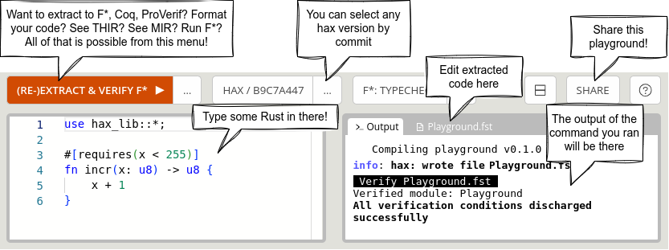

We're proud to announce the hax playground! Inspired by the [Rust
Playground](https://play.rust-lang.org/), the hax playground allows
you to play with hax directly in your web browser!

We believe such a playground can be a great and useful tool, whether
it be for newcommers, for people that already are hax users, for hax
devs, but also for people interested in Rust in general!

## Proving Rust code with F* online
Just type some Rust code and click "Extract & Verify F*". You can then
play with the resulting F\* code, edit it, typecheck it. Below is an
example of a simple proof conducted entirely in Rust:

<video src="fstar-proof.webm" width="100%" autoplay loop></video>

## Share the playground
You can share a playground instance, with all the settings: just click
the top-right corner button "Share". From there, you get a link you
can share. You can also open an issue on hax repo directly, or open
the snippet in the Rust playground.

<video src="share.webm" width="100%" autoplay loop></video>

## Inspect the Rust ASTs (THIR and MIR)
Just right click on any Rust chunk of code and inspect a enriched THIR or
MIR abstract syntax tree!

<video src="explore-thir.webm" width="100%" autoplay loop/></video>

## Conclusion

We hope to make hax more accessible and nicer to use with this web
playground, please try it, play with it and give us feedback!

