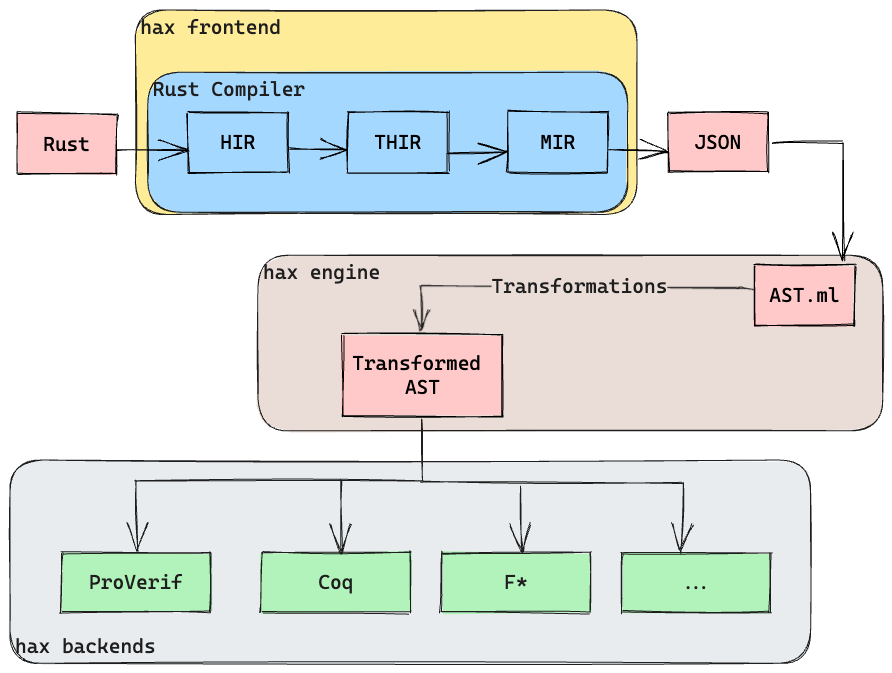

This has been in the making for a while now.
But we are finally happy to announce the first release of `hax`.
It is still early days and we only tagged v0.1.
But a ton of work has gone into this release.

> Wait, what is hax?

Let's start at the beginning.
We started hacspec (high assurance crypto specifications), a language for specifying
cryptographic primitives as the basis for formal verification, in early 2018 at
the [HACS workshop].
After two [iterations](https://github.com/hacs-workshop/hacspec) on [hacspec](https://github.com/hacspec/hacspec)
the project outgrew the name.

Here comes **hax**.
hax is a tool for high assurance translations that translates a large subset of
Rust into formal languages such as [F\*](https://www.fstar-lang.org/) or [Coq](https://coq.inria.fr/).
This extends the scope of the project, which was previously a DSL embedded in Rust,
to a usable tool for verifying Rust programs.

> So what is hacspec now?

hacspec is the functional subset of Rust that can be used, together with a hacspec
standard library, to write succinct, executable, and verifiable specifications in
Rust.
These specifications can be translated into formal languages with hax.


# hax

There are a number of Rust verification projects out there, for example [Kani], [Crux-Mir], or [MIRAI].
While most of them try to precisely model a large part of the Rust language,
hax aims to be a usable tool that captures a large subset of Rust without trying
to capture or model everything.
We believe that it is more important in practice to have a usable tool that ingests large
Rust crates to show properties on certain parts of the code, instead of modelling
the entire Rust language.

hax has two parts: the exporter and the engine.

## The exporter

When hax is invoked on a Rust crate,
the exporter hooks into the Rust compiler.
Compiling a program,
Rust transformes the user source code
to various internal representations in an optimized fashion
(essentially [HIR], [THIR] and [MIR], illustrated in the diagram below).
While this is great within the compiler,
those representations are not friendly to external tool consumption.

The hax exporter is a
[Rust driver](https://rustc-dev-guide.rust-lang.org/rustc-driver.html)
that provides a bridge
from those unstable internal representations
to fixed and easy-to-consume ASTs[^1] (abstract syntax trees).
The `JSON` node on the diagram below represents those ASTs.



The hax exporter is not opinionated toward the hax project:
it can be used as a frontend to the Rust compiler in other projects.
For example, the [Aeneas](https://github.com/AeneasVerif/aeneas) toolchain is
[already moving toward](https://github.com/AeneasVerif/aeneas/pull/35) our exporter.

## The engine

The magic of hax really happens in the engine, written in OCaml.
It directly consumes[^2] the output of the exporter, that is,
the ASTs exported for your crate of choice.

Upon the backend choice (for instance: shall we extract to F\* or to
Coq?), the engine proceeds to a sequence of typed[^3] program
transformations, eventually landing into the sublanguage supported by
the targeted language, e.g. F\*.

The various program transformations are called _phases_. We have a
dozen of them:

- transforming and functionalizing `for` loops;
- functionalizing local mutation;
- rewrite functions with mutable references as inputs into state-passing;
- and many more!

Those phases are statically typed: for instance, making `for` loops
functional is not possible on an AST that still contains local
mutation. Such constraints are ensured statically, reducing
opportunities for bugs.

This typed phase design allows us to target heterogeneous languages:
for instance F\* and [EasyCrypt](mhttps://github.com/EasyCrypt/easycrypt).

# Usage

hax is still heavily under development.
It is therefore recommended to install it straight from the [git repository]
(see the [Installation section](https://github.com/hacspec/hax#installation)
in the readme).

After installing it you can call it from any Rust crate.

```bash
cargo hax into fstar
```

This will extract the crate to F\*.
Similarly, `cargo hax into coq` will extract the crate to Coq.

For more options use

```bash
cargo hax into --help
```

# Example

We walk through a sample usage of hax based on an example.
The example can be found in the [git repository](https://github.com/hacspec/hax/tree/main/examples/lob).

Go to the `proofs/fstar/extraction` directory and run `make`.
This will first call

```
cargo hax into -i '-** +**::process_order' fstar
```

in order to extract the `process_order` order function to F\*.
This demonstrates one particularly useful feature in hax, which allows extracting
only a small portion or single function from a much larger crate.
The argument `-i '-** +**::process_order'` tells hax to include the `process_order`
function in any module and exclude (`-**`) everything else.
In addition to the function itself, hax extracts all the required dependencies within
the crate as well.

<details>
<summary>Rust</summary>

```rust
fn process_order<T>(mut order: Order, other_side: &mut BinaryHeap<T>) -> (Vec<Match>, Option<Order>)
where
    T: Into<Order> + From<Order> + Ord + Clone,
{
    ...
    if let Some(m) = other_side
        .peek()
        .and_then(|other| Into::into(other.clone()).try_match(&order))
    {
        order.quantity -= m.quantity;
        let mut other: Order = Into::into(other_side.pop().unwrap());
        other.quantity -= m.quantity;
        if other.quantity > 0 {
            other_side.push(From::from(other.clone()));
        }
        matches.push(m);
    } else {
        done = true;
    }
    ...
}
```

</details>

<details>
<summary>F*</summary>

```ocaml
match
  Core.Option.impl__and_then (Alloc.Collections.Binary_heap.impl_10__peek other_side
      <:
      Core.Option.t_Option v_T)
    (fun other ->
        impl__Order__try_match (Core.Convert.f_into (Core.Clone.f_clone other <: v_T)
            <:
            t_Order)
          order
        <:
        Core.Option.t_Option t_Match)
  <:
  Core.Option.t_Option t_Match
with
| Core.Option.Option_Some m ->
  let order:t_Order = { order with f_quantity = order.f_quantity -! m.f_quantity } in
  let tmp0, out:(Alloc.Collections.Binary_heap.t_BinaryHeap v_T &
    Core.Option.t_Option v_T) =
    Alloc.Collections.Binary_heap.impl_9__pop other_side
  in
  let other_side:Alloc.Collections.Binary_heap.t_BinaryHeap v_T = tmp0 in
  let hoist1:Core.Option.t_Option v_T = out in
  let hoist2:v_T = Core.Option.impl__unwrap hoist1 in
  let (other: t_Order):t_Order = Core.Convert.f_into hoist2 in
  let other:t_Order = { other with f_quantity = other.f_quantity -! m.f_quantity } in
  let other_side:Alloc.Collections.Binary_heap.t_BinaryHeap v_T =
    if other.f_quantity >. 0uL
    then
      let other_side:Alloc.Collections.Binary_heap.t_BinaryHeap v_T =
        Alloc.Collections.Binary_heap.impl_9__push other_side
          (Core.Convert.f_from (Core.Clone.f_clone other <: t_Order) <: v_T)
      in
      other_side
    else other_side
  in
  let matches:Alloc.Vec.t_Vec t_Match Alloc.Alloc.t_Global =
    Alloc.Vec.impl_1__push matches m
  in
  done, matches, order, other_side
| _ ->
  let done:bool = true in
  done, matches, order, other_side
```

</details>

<pre></pre>

Then the makefile calls F\* on the generated output.
The successful typechecking in F* proves two properties on the Rust code.

First it shows that the lines with

```rust
order.quantity -= m.quantity;
```

do not underflow.

XXX: What's the condition checked in F* here?

Second, it shows that

```rust
other_side.pop().unwrap()
```

never panics, i.e. the `pop` always returns `Some` value and thus never panics.

# Call to Action

hax is still under heavy development and there are many features we want to add, and many bugs to squash.
We invite everyone to contribute to the project with new backends, contributing to the hax frontend or backend, or provide examples to exercise the tool.

## Resources

- [Zulip]
- [Git Repository]

[hacs workshop]: https://www.hacs-workshop.org/
[git repository]: https://github.com/hacspec/hax
[zulip]: https://hacspec.zulipchat.com/
[MIR]: https://rustc-dev-guide.rust-lang.org/mir/index.html
[THIR]: https://rustc-dev-guide.rust-lang.org/thir.html
[HIR]: https://rustc-dev-guide.rust-lang.org/hir.html
[kani]: https://github.com/model-checking/kani
[crux-mir]: https://github.com/GaloisInc/crucible/tree/master/crux-mir
[mirai]: https://github.com/facebookexperimental/MIRAI

[^1]: Rust's internal ASTs are very optimized in memory and require constantly to lookup things interactively with the Rust compiler. Instead, our ASTs are indirection-free trees packing as much informations as possible (e.g. types, attributes, spans...), ready for direct consumption.
[^2]: The exporter expose big ASTs as JSON. The Rust type definitions of those ASTs are automatically converted into OCaml type definition along with JSON serializer and deserializers, using [JSON Schemas](https://json-schema.org/).
[^3]: The internal AST used by the hax engine is [functorized](https://ocaml.org/docs/functors). This enables AST transformations to be strongly typed.
