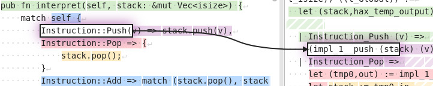

Despite some team members attending an offsite work week event, we
merged 24 PRs this month. Here's an overview of the work of the month.

The frontend remained stable this month, with only a few pull requests
focused on small improvements and bug fixes. Our CI now tests the
extraction of [Rust by
Example](https://doc.rust-lang.org/rust-by-example/).

[cmester0](https://github.com/cmester0) is working on an annotated core
library, which is extractable via hax to multiple backends. The Coq
backend now uses this generated core library, and ships with an
example.

I want to add source maps to hax for a long time. A source map is a
file that maps transformed code to its original source code. This
mapping is particularly useful in debugging, allowing developers to
see the original source code when errors occur or when stepping
through code in a debugger.

Support for source maps was added previously, but was not really
usable. Source maps are now being automatically for the backends using
the generic printer (currently only Coq does so). Here is a preview:

Lastly, we fixed a several issues and enhanced the engine. For
instance, control is now rewritten correctly within closures.

Get involved with Hax! Submit issues, suggest improvements, or upvote
the ones you care about on GitHub. Every contribution counts! ☀️

# Merged Pull Requests
* #1149: [Revert "fix(engine): item ordering"](https://github.com/hacspec/hax/pull/1149)
* #1147: [Engine: F*: fix `\0`](https://github.com/hacspec/hax/pull/1147)
* #1146: [Improve `setup.sh`](https://github.com/hacspec/hax/pull/1146)
* #1140: [fix(engine): item ordering](https://github.com/hacspec/hax/pull/1140)
* #1123: [Engine: source maps: fix bugs, add features, enable for Coq](https://github.com/hacspec/hax/pull/1123)
* #1122: [Various tweaks](https://github.com/hacspec/hax/pull/1122)
* #1121: [fix typos in the book](https://github.com/hacspec/hax/pull/1121)
* #1118: [doc(book/include-flags): improve](https://github.com/hacspec/hax/pull/1118)
* #1117: [Upstream fstar core changes from cryspen-sandwich.](https://github.com/hacspec/hax/pull/1117)
* #1116: [feat(frontend/cli): improve options](https://github.com/hacspec/hax/pull/1116)
* #1115: [Cryspen green.](https://github.com/hacspec/hax/pull/1115)
* #1114: [feat(engine) Extract vals for trait impls in interface only mode.](https://github.com/hacspec/hax/pull/1114)
* #1111: [chore(engine): ocamlformat: update: 0.24.1 -> 0.26.2](https://github.com/hacspec/hax/pull/1111)
* #1102: [fix(engine) Fix deprecated attribute for compatibility with ocaml 5.2.](https://github.com/hacspec/hax/pull/1102)
* #1101: [fix(engine) Drop return/break/continue inside closures.](https://github.com/hacspec/hax/pull/1101)
* #1100: [Fix spans in error reporting with unicode characters.](https://github.com/hacspec/hax/pull/1100)
* #1094: [Fix ml-kem ci job.](https://github.com/hacspec/hax/pull/1094)
* #1092: [feat(ci): test rust by examples (extract to F*)](https://github.com/hacspec/hax/pull/1092)
* #1091: [Add example for Coq](https://github.com/hacspec/hax/pull/1091)
* #1090: [feat(engine/f*): add dummy support for floats](https://github.com/hacspec/hax/pull/1090)
* #1080: [feat(engine): keep track of parent items in spans](https://github.com/hacspec/hax/pull/1080)
* #1064: [Move to annotated core lib](https://github.com/hacspec/hax/pull/1064)
* #1004: [Restore neg_equiv_lemma](https://github.com/hacspec/hax/pull/1004)
* #983: [feat(hax-lib): intro. `hax` feature](https://github.com/hacspec/hax/pull/983)

### Contributors
* [@cmester0](https://github.com/cmester0)
* [@W95Psp](https://github.com/W95Psp)
* [@jschneider-bensch](https://github.com/jschneider-bensch)
* [@spitters](https://github.com/spitters)
* [@franziskuskiefer](https://github.com/franziskuskiefer)
* [@Nadrieril](https://github.com/Nadrieril)
* [@karthikbhargavan](https://github.com/karthikbhargavan)
* [@maximebuyse](https://github.com/maximebuyse)
* [@paulmure](https://github.com/paulmure)
